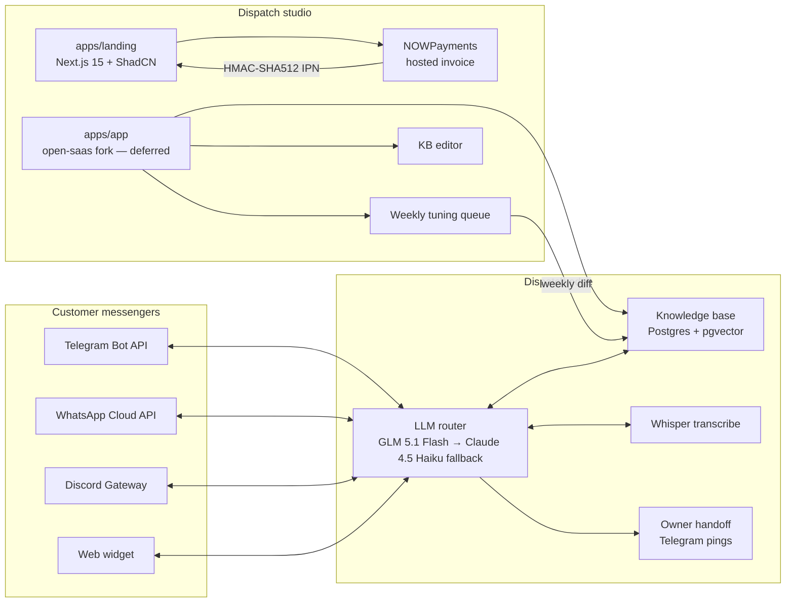

# 02 — Architecture

> Wave 2 ships only the customer-facing landing surface (`apps/landing/`) and a stub for the future dashboard (`apps/app/`). This document describes the **target system** so the landing's promises and the future dashboard's scope match the same picture.

## System diagram

## Components

### apps/landing — Next.js 15 + ShadCN (THIS WAVE)

The customer-facing surface this Wave 2 ships. Hand-coded from ShadCN primitives where present (Button, Card), remainder hand-coded to keep the editorial dispatch aesthetic. Hosts:

- Public marketing pages (hero, day-by-day, what-you-get, pricing, FAQ).
- The NOWPayments invoice route (`/api/checkout/nowpayments`) and IPN webhook (`/api/webhooks/nowpayments`).
- A `/checkout/return` view to render success/cancelled states.

### apps/app — open-saas fork (DEFERRED)

`apps/app/.gitkeep` + a README explaining the fork plan. Will be applied later from `wasp-lang/open-saas` as a vendored fork; will own:

- Magic-link auth.
- Customer dashboard: KB editor, tuning queue, weekly accuracy report.
- Channel connectors page (TG / WA / DC token wiring).
- Subscription management surface (read-only against NOWPayments invoices for the v1 motion).

### Edge runtime (out of scope this wave)

- **LLM router** — GLM 5.1 Flash for >80% of replies, Claude 4.5 Haiku for the long tail. No Opus / GPT-5 in production. Whisper for voice notes. Hosted on Hetzner CX dedicated; per-tenant queues.
- **Knowledge base** — Postgres 16 + pgvector. One row per chunk; metadata flags from KB ingest.
- **Connectors** — Telegram Bot API, WhatsApp Cloud API (Meta), Discord Gateway, an embeddable web widget (iframe). Each tenant has its own credentials; no shared numbers.
- **Owner handoff** — when the bot's confidence drops below the per-tenant threshold, it pings the owner on Telegram and silences itself for that thread.

### Payments (THIS WAVE)

NOWPayments hosted invoice. The customer clicks a tier, the landing calls `POST /v1/invoice` server-side, redirects to NOWPayments. The IPN webhook is an HMAC-SHA512 verifier (`x-nowpayments-sig` over alphabetically sorted JSON). Until `apps/app/` ships there's no DB — verified webhook events go to journalctl and a brief Telegram notification to the dispatcher.

## Data flows

### Customer self-serve checkout (this wave)

1. Customer clicks **Take Starter / Growth / Pro** on the landing.
2. Landing's server route `POST /api/checkout/nowpayments` calls NOWPayments `POST /v1/invoice` with `price_amount`, `order_id`, `ipn_callback_url`, `success_url`, `cancel_url`.
3. NOWPayments returns an `invoice_url` — landing 302s to it.
4. Customer pays USDT/USDC on the NOWPayments hosted page.
5. NOWPayments POSTs the IPN to `/api/webhooks/nowpayments` with `x-nowpayments-sig`.
6. The handler verifies the HMAC-SHA512 over alphabetically sorted JSON; on `payment_status === finished`, logs the verified event with the order id. (Future: triggers `apps/app/` onboarding workflow.)

### Customer message handling (deferred)

1. Customer sends DM on TG/WA/DC.
2. Connector forwards to LLM router with tenant id and channel.
3. Router pulls top-k KB chunks via pgvector; calls GLM 5.1 Flash (or escalates to Haiku).
4. Confidence < threshold → silence + Telegram ping to owner via Handoff.
5. Reply posts back through the same connector. Conversation logged for the weekly tuning report.

## Deploy topology

| Surface | Where | Provider |
|---|---|---|
| `apps/landing` (this wave) | `https://chatbot-agency.prin7r.com` | storage-contabo (Hetzner-class VPS) behind Traefik (Docker provider) |
| `apps/app` (deferred) | `https://app.chatbot-agency.prin7r.com` | same host or a dedicated Hetzner CX, TBD |
| LLM router (deferred) | private Hetzner CX | dedicated, per-region |
| Postgres + pgvector (deferred) | private Hetzner CX | replicated EU/CIS |
| Connectors (deferred) | small Deno Deploy or Cloudflare Workers per channel | depending on rate-limit shape |

## Reliability and fallbacks

- **Channel resilience.** Every contract carries Telegram fallback. If WhatsApp suspends a tenant number, traffic routes to TG until the customer reissues a Cloud API number.
- **LLM provider resilience.** Router carries three providers (GLM, Anthropic, self-hosted Llama 3.x). No single-provider beta features in production.
- **Invoice resilience.** NOWPayments is the default. Plisio is wired in `payments-prototypes` as a no-KYC backup; not exposed on the landing this wave.
- **Knowledge resilience.** Monthly auto-recrawl + diff to the customer; if a customer skips a tuning hour for three months, the bot enters reduced-confidence mode and prefixes its replies with a "last updated 90+ days ago" notice.

## What is intentionally not in the architecture

- A custom flow-builder UI. The customer never builds flows; they hand us a knowledge base and we tune.
- Payment collection inside the bot. We integrate with payment links; we never hold funds.
- A model fine-tune per customer. Everything is prompt + RAG.
- A Stripe / FastSpring rail in v1. Crypto-first by design — see `docs/07-sales-strategy.md`.
