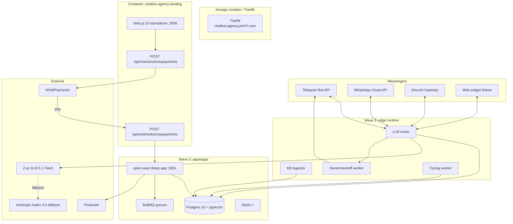
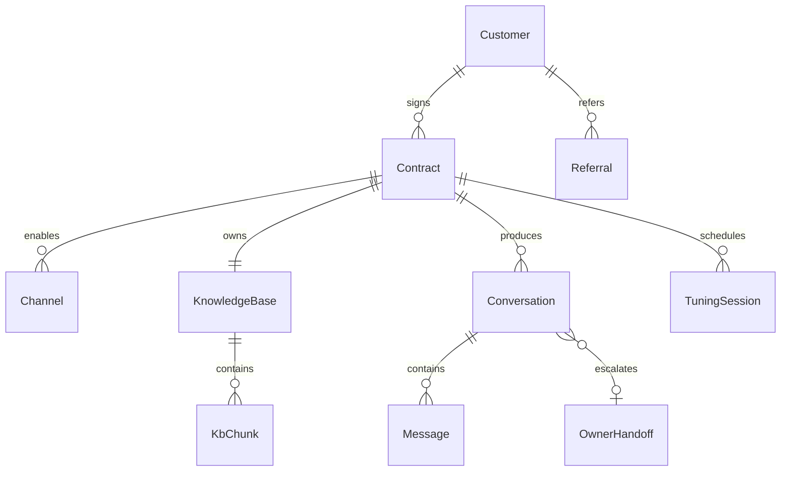

# 12 — Technical Specification

This is the authoritative technical contract for Relayhouse Wave 2 → Wave 3. Doc 11 specifies user-visible flows; this doc specifies runtime, schema, contracts, and operational guardrails. Every endpoint here traces back to a story in doc 11.

---

## 1. Architecture overview

The Wave 2 surface is a Next.js 15 (App Router) marketing landing with two server routes (checkout + webhook). Wave 3 brings online: dashboard (`apps/app/`), KB ingester, LLM router, channel connectors, owner-handoff worker, weekly tuning worker.



---

## 2. Data model

### 2.1 Entities



### 2.2 Schema sketch (Drizzle, Postgres 16 + pgvector)

```typescript
export const customers = pgTable('customers', {
  id: uuid('id').primaryKey().defaultRandom(),
  email: text('email').notNull().unique(),
  language: text('language').default('en'),  // 'en'|'ru'|'es'|'uk'|'pt'
  agencyPartnerCode: text('agency_partner_code'),
});

export const contracts = pgTable('contracts', {
  id: text('id').primaryKey(),  // 'relay_growth_<ts>_<rand>'
  customerId: uuid('customer_id').references(() => customers.id),
  tier: text('tier').notNull(),   // 'starter'|'growth'|'pro'|'enterprise'
  status: text('status').default('pending'),  // 'pending'|'active'|'paused'|'cancelled'
  setupFeeUsd: numeric('setup_fee_usd', {precision:10,scale:2}),
  monthlyFeeUsd: numeric('monthly_fee_usd', {precision:10,scale:2}),
  includedMessages: integer('included_messages'),
  overageRateUsd: numeric('overage_rate_usd', {precision:10,scale:4}),
  tuningHoursPerMonth: integer('tuning_hours_per_month'),
  goLiveDate: date('go_live_date'),
  ownerHandoffThreshold: numeric('owner_handoff_threshold', {precision:3,scale:2}).default('0.65'),
  referralCode: text('referral_code'),
  activatedAt: timestamp('activated_at'),
  createdAt: timestamp('created_at').defaultNow(),
});

export const channels = pgTable('channels', {
  id: uuid('id').primaryKey().defaultRandom(),
  contractId: text('contract_id').references(() => contracts.id),
  kind: text('kind').notNull(),  // 'telegram'|'whatsapp'|'discord'|'web_widget'
  externalIdentifier: text('external_identifier').notNull(),
  apiTokenEncrypted: text('api_token_encrypted').notNull(),
  status: text('status').default('healthy'),
});

export const knowledgeBases = pgTable('knowledge_bases', {
  id: uuid('id').primaryKey().defaultRandom(),
  contractId: text('contract_id').references(() => contracts.id),
  toneOfVoice: text('tone_of_voice'),
  forbidTopics: jsonb('forbid_topics').default('[]'),
  lastIngestAt: timestamp('last_ingest_at'),
});

export const kbChunks = pgTable('kb_chunks', {
  id: uuid('id').primaryKey().defaultRandom(),
  kbId: uuid('kb_id').references(() => knowledgeBases.id),
  source: text('source'),  // url or filename
  text: text('text').notNull(),
  embedding: vector('embedding', { dimensions: 1536 }),
  hash: text('hash').notNull(),
  createdAt: timestamp('created_at').defaultNow(),
});

export const conversations = pgTable('conversations', {
  id: uuid('id').primaryKey().defaultRandom(),
  contractId: text('contract_id').references(() => contracts.id),
  channelId: uuid('channel_id').references(() => channels.id),
  externalUserId: text('external_user_id'),
  language: text('language'),
  startedAt: timestamp('started_at').defaultNow(),
});

export const messages = pgTable('messages', {
  id: uuid('id').primaryKey().defaultRandom(),
  conversationId: uuid('conversation_id').references(() => conversations.id),
  direction: text('direction').notNull(),  // 'inbound'|'outbound'
  text: text('text').notNull(),
  confidence: numeric('confidence', {precision:5,scale:4}),
  createdAt: timestamp('created_at').defaultNow(),
});

export const ownerHandoffs = pgTable('owner_handoffs', {
  id: uuid('id').primaryKey().defaultRandom(),
  conversationId: uuid('conversation_id').references(() => conversations.id),
  reason: text('reason').notNull(),  // 'low_confidence'|'forbidden_topic'|'customer_demand'
  pingedAt: timestamp('pinged_at').defaultNow(),
  resolvedByOwnerAt: timestamp('resolved_by_owner_at'),
});

export const tuningSessions = pgTable('tuning_sessions', {
  id: uuid('id').primaryKey().defaultRandom(),
  contractId: text('contract_id').references(() => contracts.id),
  scheduledFor: timestamp('scheduled_for').notNull(),
  completedAt: timestamp('completed_at'),
  diffSummary: jsonb('diff_summary'),
});
```

Indexes: `kbChunks.embedding` ivfflat; `messages(conversation_id, created_at)`; `channels(contract_id, kind)`.

---

## 3. API contracts

### 3.1 `POST /api/checkout/nowpayments` (Wave 2 + 3)

- Body: `{ tier: 'starter'|'growth'|'pro', referralCode? }`.
- Returns 201: `{ invoice_url, invoice_id, contractId }`.

### 3.2 `POST /api/webhooks/nowpayments` (Wave 2 + 3)

- HMAC-SHA512 over sorted-keys body. Constant-time compare.
- On `payment_status='finished'`, mark contract `active`, send dispatcher Telegram ping.
- 200 verified, 401 bad sig, 200 idempotent replay.

### 3.3 `POST /api/admin/contracts` (Wave 3)

- Auth: Bearer `ADMIN_API_KEY`.
- Body: `{ customerId, tier, customSetupFeeUsd?, customMonthlyFeeUsd? }`. For Enterprise.
- 201: `{ contractId, invoiceUrl }`.

### 3.4 `POST /api/contracts/:id/channels` (Wave 3)

- Auth: Bearer customer JWT (must own contract).
- Body: `{ kind, externalIdentifier, apiToken }`.
- Heartbeat validates the token; encrypts it with `INTEGRATION_KEY`.
- 201: `{ channelId, status: 'healthy' }`.

### 3.5 `POST /api/contracts/:id/kb/ingest` (Wave 3)

- Auth: Bearer customer JWT.
- Body: `{ sources: [{ kind: 'url'|'pdf'|'notion'|'gdoc', value }] }`.
- Enqueues KB ingestion job. Returns `{ jobId, eta }`.

### 3.6 `GET /api/contracts/:id/conversations?since=7d` (Wave 3)

- Auth: Bearer customer JWT.
- Returns: `[{ conversationId, channel, language, messageCount, ownerHandoff }, …]`.

### 3.7 `GET /api/contracts/:id/accuracy?period=week` (Wave 3)

- Auth: Bearer customer JWT.
- Returns: `{ resolutionRate, escalationRate, avgResponseMs, confidentButWrongRate }`.

### 3.8 `POST /api/admin/orders/:contractId/refund` (Wave 3)

- Auth: Bearer `ADMIN_API_KEY`.
- Body: `{ reason }`.
- Refunds setup fee via NOWPayments admin path (manual); marks contract `paused`.

### 3.9 Inbound message webhook (Wave 3, per channel)

- Telegram: `POST /api/webhooks/telegram/:contractId`.
- WhatsApp: `POST /api/webhooks/whatsapp/:contractId` (Meta verification + signed body).
- Discord: WSS gateway.
- All inbound messages enter the LLM router queue.

### 3.10 LLM router contract (internal)

- Input: `{ contractId, channelId, conversationId, externalUserId, text, language }`.
- Output: `{ replyText, confidence, ragSourceIds, llmProvider }`.
- If `confidence < contract.ownerHandoffThreshold`, output is replaced with a no-op + a `ownerHandoff` row created.

---

## 4. Integrations

| Service | Purpose | Auth | Rate limit | Fallback |
|---|---|---|---|---|
| **NOWPayments** | Hosted invoice + IPN | `x-api-key` | 60 req/min | 502 retry, brand-voice toast |
| **Telegram Bot API** | Inbound DMs | Per-tenant bot token | varies | Auto-pause channel on 3 consecutive errors |
| **WhatsApp Cloud API** | Inbound DMs | Per-tenant Meta access token + phone number id | 250 msg/s/business | Auto-pause + Slack alert; fallback to TG-only |
| **Discord Gateway** | Inbound community DMs | Per-tenant bot token | 50 msg/s | Same |
| **Z.ai GLM 5.1 Flash** | Primary LLM | API key (platform-owned) | 1k req/s | Fallback to Haiku 4.5 |
| **Anthropic Haiku 4.5** | LLM fallback | API key | 4k req/s | If both down, bot enters owner-handoff for all |
| **Whisper (self-hosted)** | Voice note transcription | self-hosted endpoint | n/a | Skip voice → ping owner |
| **Postmark** | Transactional email | Server token | 5k/h Pro | BullMQ retry |

---

## 5. Storage

- **Wave 2.** No DB. Stateless landing.
- **Wave 3.** Postgres 16 + pgvector for embeddings, on a Hetzner CX dedicated host (per architecture doc).
- **Encryption.** Channel tokens encrypted with `INTEGRATION_KEY` (AES-256-GCM).
- **Retention.**
  - Conversations: 90 days (rolling delete; longer for active contracts).
  - KB chunks: lifetime of contract + 30 days.
  - Owner handoffs: 90 days.
  - Webhook receipts: 30 days stdout, 90 days DB.
  - PII: GDPR-DSAR compliant.

---

## 6. Auth

- Public landing: no auth.
- Customer dashboard (Wave 3): magic-link via open-saas.
- Partner dashboard: same auth, gated by `customers.agencyPartnerCode IS NOT NULL`.
- Admin endpoints: Bearer `ADMIN_API_KEY`, 90-day rotation.

---

## 7. Security

Top 5 threats + mitigations:

1. **Forged IPN.** *Mitigation:* HMAC-SHA512 + constant-time compare.
2. **Channel token leak.** *Mitigation:* Encrypted at rest with `INTEGRATION_KEY`; never logged; never returned in API.
3. **Bot replying with hallucinated info.** *Mitigation:* Strict RAG (top-k from KB; if best score < threshold, owner handoff). Forbidden-topic refusal list hardcoded.
4. **WhatsApp Cloud API ban (account quality drops).** *Mitigation:* No outbound cold messaging; rate-limit per business; auto-pause on Meta-issued warning.
5. **Customer using bot for compliance-sensitive output (medical, legal, financial).** *Mitigation:* Hardcoded refusal list per contract; ToS forbids these verticals; refund process if violated.

CSRF: Next.js default + samesite=lax. CORS: locked to `chatbot-agency.prin7r.com` and `app.chatbot-agency.prin7r.com`. Rate limits at Traefik.

---

## 8. Observability

- **Logs.** Stdout JSON `{ ts, level, route, contractId?, conversationId?, event, message }`. PII scrubbed.
- **Metrics.** Wave 3: counters for `messages_inbound_total`, `messages_outbound_total`, `owner_handoffs_total`, `confidence_below_threshold_total`, `channel_health_status`.
- **Alerts.**
  - Webhook sig failures >5/h → Slack `#alerts-relayhouse`.
  - Channel health degraded >10min → Slack.
  - Bot accuracy drops >5pp week-over-week → Slack + auto-flag for tuning.
  - Daily new contracts <2σ below 30-day mean → Slack.
- **Trace.** `requestId` UUID minted at edge.

---

## 9. Performance budgets

| Surface | Metric | Budget |
|---|---|---|
| Landing TTFB | p95 | <200ms |
| Landing LCP | p75 | <2.5s |
| `POST /api/checkout/nowpayments` | p95 | <1.5s |
| `POST /api/webhooks/nowpayments` | p95 | <250ms |
| LLM router reply latency | p95 | <2s end-to-end |
| Owner handoff ping | p95 | <5s from low-confidence event |
| KB ingest job | p95 | <10min for a 50KB knowledge base |
| Throughput sustained | landing 50 RPS, checkout 10 RPS, inbound webhook 200 RPS, router 100 conversations/min |

---

## 10. Non-goals

- **No flow-builder UI** (doc 11 AS-1).
- **No outbound cold messaging** (AS-2). WhatsApp Cloud API ToS forbids.
- **No payment collection inside bot** (AS-3).
- **No fine-tune per customer** (AS-4). Prompt + RAG only.
- **No 24/7 human SLA** (AS-5). Weekly tuning hour only.
- **No SOC 2 / HIPAA / FedRAMP** through Wave 5+ (AS-6). Compliance-sensitive verticals declined.
- **No bot voice calls** through Wave 5+. Text + Whisper voice notes only.
- **No mobile-native dashboard.** Responsive web only.
